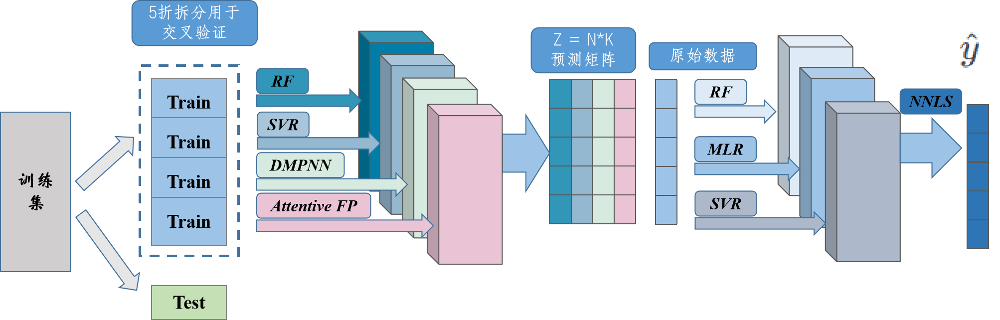

# Stacking 集成模型


我们评估了基于分子描述符的五种机器学习算法 [随机森林 (RF)，支持 向量回归 (SVR)，深度学习模型 (DNN)，梯度提升树 (GBM)，Adaboost 提升树 (ADA) 以及基于图的三种图神经网络 [信息传递神经网络 (D-MPNN), Attentive FP 模型, 图卷积神经网络 GCN] 来解决化合物毒性预测的问题。使用超级学习器（Super learner）方法搭建了三层的 Stacking 集成模型，作为毒性预测的QSAR模型。考虑位于活性悬崖 (ACs) 中的化合物，基于分子描述符和目标特征，给出了表征模型适用域 AD 的方法。

本仓库提供了一种简便方法，支持调用两种基于可扩展性指纹ECFP的机器学习模型（RF和SVR），以及基于分子图的两种机器学习模型（D-MPNN,Attentive FP）

# 安装


# 数据

QSAR模型需要基于分子的结构性质，模型通过数据中的smiles描述符进行训练和预测。

Stacking 集成模型目前只支持回归任务（分类任务还在开发中）

数据输入应该是满足如下格式的csv文件：
* 三列，第一列为索引，第二列列名必须为"smiles"，第三列列名必须为"LogLD"为对应分子的对数半致死浓度。

比如
```
,smiles,LogLD
0,CC1(C)C(C=C(Cl)Cl)C1C(=O)OC(C#N)c1cccc(Oc2ccccc2)n1,2.957682227
1,Cc1cc(O)cc(C)c1Cl,1.611626262
2,CC(=O)Oc1ccc(C(c2ccc(OC(C)=O)cc2)c2ccccn2)cc1,1.924011387
3,CC(Oc1ccc(Cl)cc1Cl)C(=O)O,2.532970595
4,COC(=O)C=Cc1ccccc1,1.793378211
5,CC(C)NCC(O)c1ccc2ccccc2c1,2.406205105
```

# 训练和预测

模型支持在本地进行训练
## 加载数据集

```
data_loader = DB.db('../DataBase/DB2.csv')
```
DB.db作为项目的数据加载器类用于数据的读取、搜索、添加、保存以及折叠切分数据集等。具体来说，该模块提供的功能包括：

1. 支持两种方式的数据读取：
   
  - read_data：从文件中读取数据，并进行预处理，如修改列顺序和重置索引。
  - get_data：加载默认路径下的数据。
2. 数据搜索：
   
  - search：根据输入的查询条件x，在数据集中查找匹配的记录。
3. 数据添加：
  
  - merge_and_average：用于将两个重叠的DataFrame对象进行平均值合并。
  - add_fuc：将新的DataFrame对象添加到原始数据集中，并对重叠的记录进行平均值合并。
4. 数据切分：
  
  - get_folds：对数据进行折叠切分，并返回迭代器。
5. 数据保存：
  
  - save_data：将数据保存到指定的文件中，文件名包含当前时间。

## 实例化模型，定义参数列表
```python
# 定义参数类
args = utils.Args(train, test, AFP=True, RF=True, MPNN=True,
                SVR=True, save_r=False, plot=True,GAT=True, DNN=True,
                AD_FP=False)
# 实例化集成模型
eb = Layers.ensemble_models()
```

参数类**Args**：
```python
class Args(train:pandas,Dataframe, test:pandas,Dataframe, predict_df:pandas,Dataframe,AFP=bool, RF=bool, MPNN=bool, SVR=bool, GAT=bool,save_r=bool,DNN=bool,MLR=bool, RF2=bool, SVR2=bool,plot=bool, AD_FP=bool,S_C=[0.8, 0.4]):
```

* train: 为模型训练集，如果你想要调用预训练模型，可以不使用此参数
* test: 为模型测试集，用于训练过程对模型性能的评估
* predict_df: 为验证集，也可以是你进行模型预测的数据集，需包含smiles描述符，可以不包括LogLD那一列。 
* AFP: bool值，控制是否使用Attentive FP
* RF: bool值，控制是否使用随机森林
* MPNN: bool值，控制是否使用MPNN
* SVR: bool值，控制是否使用SVR
* GAT: bool值，控制是否使用GAT
* save_r: 是否保存训练和预测结果
* DNN: bool值，控制是否使用DNN
* MLR: bool值，控制第二层模型是否MLR
* RF2: bool值，控制第二层模型是否RF
* SVR2: bool值，控制第二层模型是否SVR
* plot: 是否作测试集预测值和真实值的对比图
* AD_FP: 是否采用适用域处理
* S_C: S_C列表传递阈值S和C


`ensemble_models` 类，包含多个方法，用于训练和预测多种机器学习模型。

```python
Lay1_models_train(self, Args:utils.Args, save=bool):
```
训练不同的模型并生成它们的预测结果。

* Args 参数类`utils.Args`，其中应该包含训练和测试用到的数据集，以及模型的选择情况。
* save： bool值代表是否保存模型，若要进行预测，需要save=True

```python
Lay2_models_train(self, Args:utils.Args, save=bool)
```
根据第一层结果训练第二层模型

* Args 参数类`utils.Args`，其中应该包含第二层模型的选用情况。
* save： bool值代表是否保存模型，若要进行预测，需要save=True

```python
Lay3_models_train(self, Args:utils.Args):
```
训练NNLS模型并生成它们的预测结果


## 模型预测
```python
Lay1_models_predict(self, Args:utils.Args):
```
使用预训练模型或者自行训练过的模型进行预测任务
* Args:`utils.Args`其中需要定义`Args.predict_df`来输入预测数据集


```
Lay2_models_predict(self, Args:utils.Args=None):
```
使用预训练过的第二层模型或者自行训练过的第二层模型进行预测任务


```
Lay3_models_predict(self):
```
通过训练时的权重来计算三层总模型的预测结果